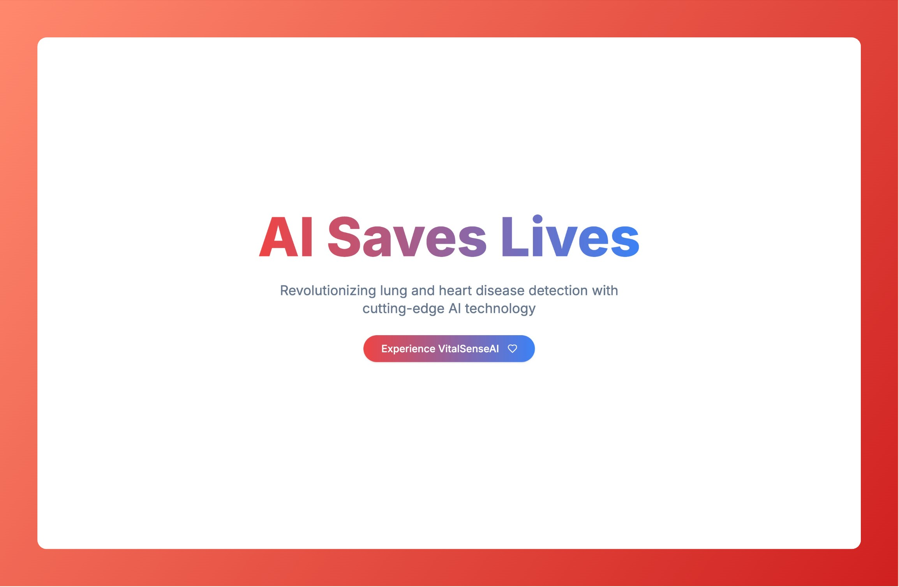
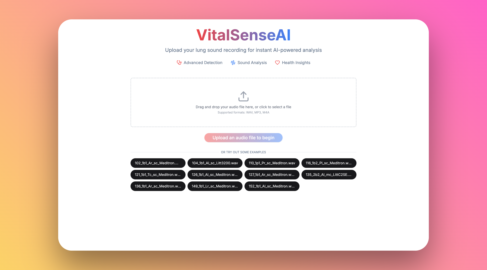
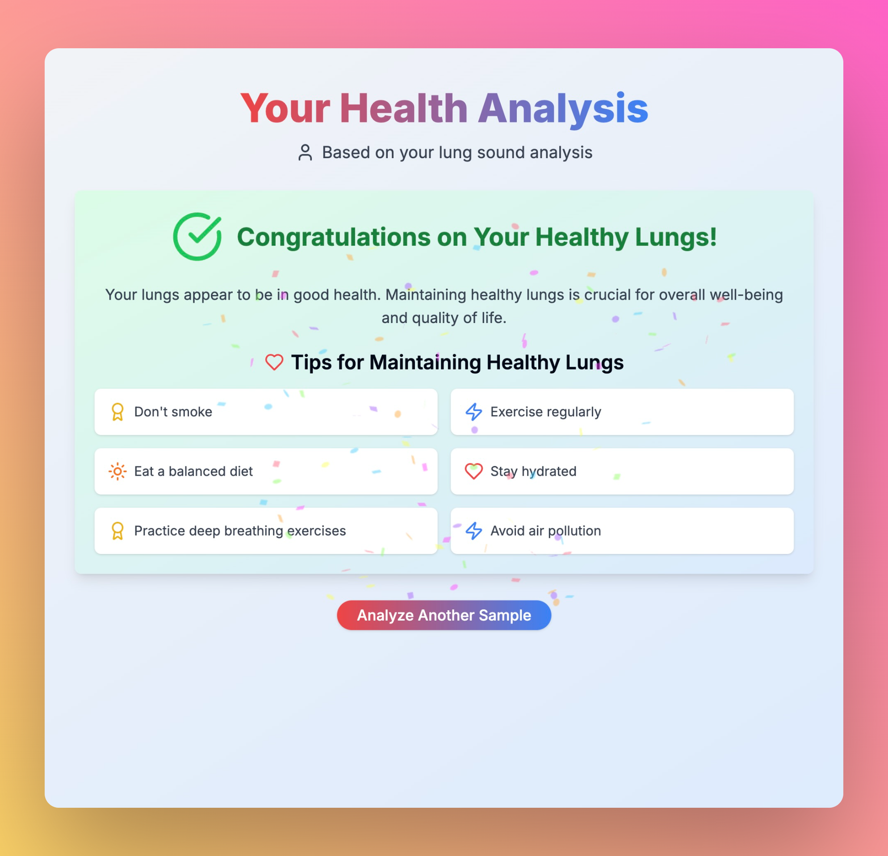
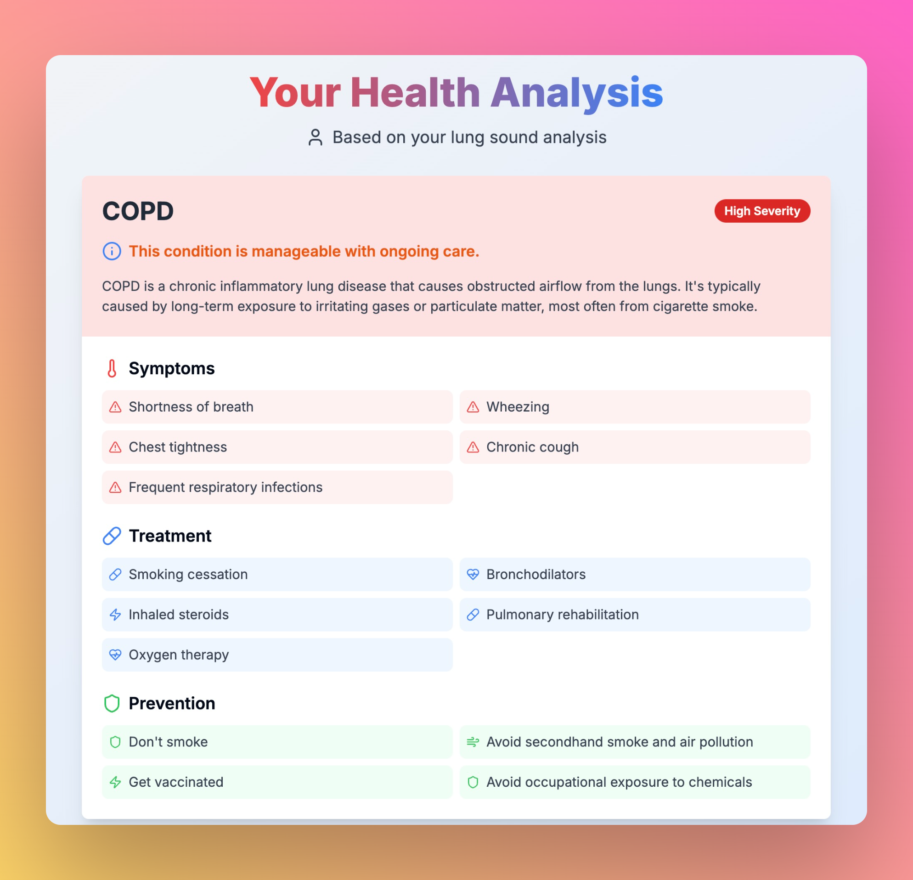
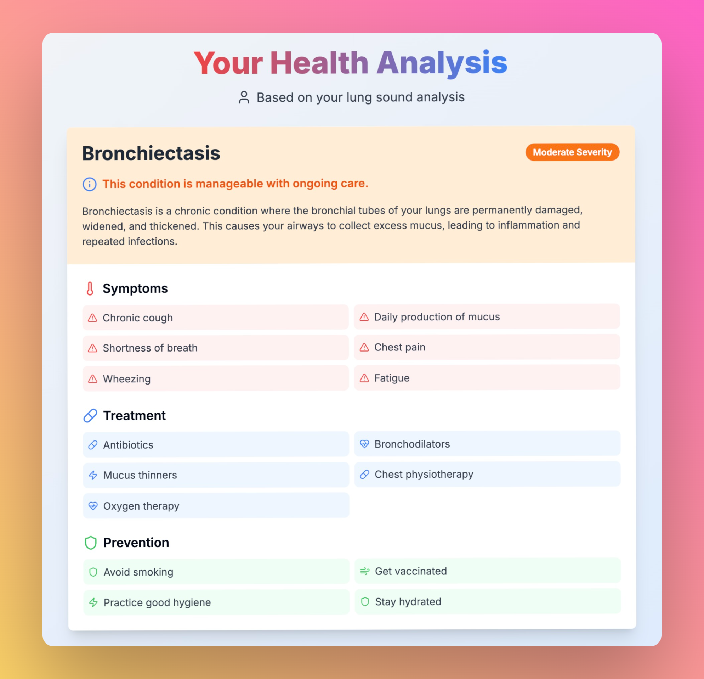
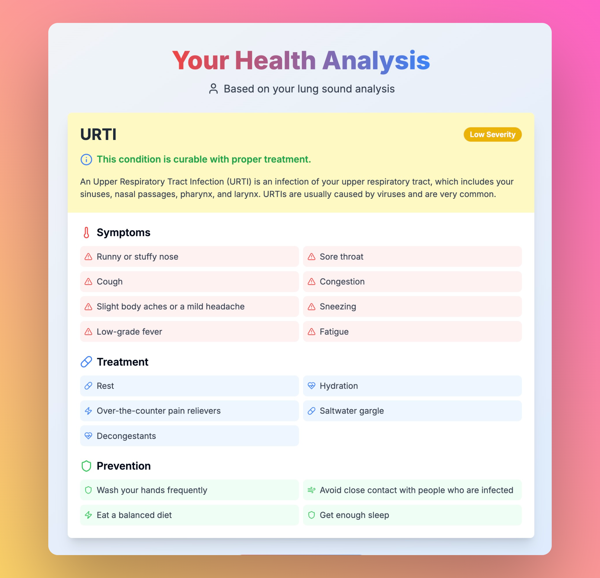

# VitalSenseAI



> **AI-Powered Lung and Heart Disease Detection**

---

## 📚 Table of Contents

- [What is VitalSenseAI?](#-what-is-vitalsenseai)
- [Screenshots](#-screenshots)
- [How It Works](#-how-it-works)
  - [About the AI Model](#-about-the-ai-model)
- [Built With](#-built-with)
- [Getting Started](#-getting-started)
- [Features](#-features)
- [Contributing](#-contributing)
- [License](#-license)

---

## 🚀 What is VitalSenseAI?

VitalSenseAI is a cutting-edge web application that leverages advanced AI models to analyze lung and heart sounds for rapid, accurate disease detection. Designed for both healthcare professionals and individuals, it empowers users to upload or record audio samples and receive instant, AI-driven health insights.

- **Website:** [vital-sense-ai.vercel.app/](https://vital-sense-ai.vercel.app/)  
- **Hugging Face Model:** [jiveshkalra/LungDiseaseDetector](https://huggingface.co/spaces/jiveshkalra/LungDiseaseDetector)
- **AI Training Github:** [Lung Disease Detector](https://github.com/jiveshkalra/lungs_disease_detection)

---

## 📸 Screenshots 

<figure>
  
  <figcaption><b>Figure 1:</b> The audio upload page where users can submit lung or heart sound recordings for analysis.</figcaption>
</figure>

<figure>
  
  <figcaption><b>Figure 2:</b> Example of an analysis result indicating healthy lung sounds.</figcaption>
</figure>

<figure>
  
  <figcaption><b>Figure 3:</b> AI model output showing detection of Chronic Obstructive Pulmonary Disease (COPD).</figcaption>
</figure>

<figure>
  
  <figcaption><b>Figure 4:</b> Analysis result page displaying a diagnosis of bronchiectasis.</figcaption>
</figure>

<figure>
  
  <figcaption><b>Figure 5:</b> Example result for an Upper Respiratory Tract Infection (URTI) detection.</figcaption>
</figure>

---

## 🧠 How It Works

1. **Record**: Capture lung or heart sounds using an electronic stethoscope.
2. **Upload**: Securely upload the audio sample to VitalSenseAI.
3. **Analyze**: My AI model, hosted on [Hugging Face Spaces](https://huggingface.co/spaces/jiveshkalra/LungDiseaseDetector), processes the sound and predicts possible diseases.
4. **Diagnose**: Instantly receive a detailed health report, including disease information, severity, and prevention tips.

### 🤖 About the AI Model
- **Model:** Custom CNN based deep learning model for lung/heart sound classification
- **Github:** [Github Repo](https://github.com/jiveshkalra/lungs_disease_detection)
- **Hosted on:** [Hugging Face Spaces](https://huggingface.co/spaces/jiveshkalra/LungDiseaseDetector)
- **API Integration:** Uses [Gradio Client](https://www.npmjs.com/package/@gradio/client) for seamless communication
- **Supported Diseases:** Healthy, COPD, Pneumonia, Bronchiectasis, URTI, and more

---

## 🛠️ Built With

- [Next.js](https://nextjs.org/)
- [React.js](https://react.dev/)
- [TailwindCSS](https://tailwindcss.com/)
- ☕ Lots of coffee

---

## 🛠️ Getting Started

### Prerequisites
- [Node.js](https://nodejs.org/) (v18+ recommended)
- [npm](https://www.npmjs.com/) 

### Installation

```bash
# Clone the repository
git clone https://github.com/jiveshkalra/vital-sense-ai.git
cd vital-sense-ai

# Install dependencies
npm install 
```

### Running Locally

```bash
npm run dev 
```

Visit [http://localhost:3000](http://localhost:3000) in your browser.

---

## 🧪 Features

- 🎤 **Audio Upload & Recording**: Upload your own lung/heart sound or try sample files
- ⚡ **Instant AI Analysis**: Get results in seconds
- 📊 **Detailed Results**: Disease info, severity, and prevention tips
- 🔒 **Privacy First**: No audio is stored; all analysis is real-time
- 📱 **Responsive**: Works on mobile, tablet, and desktop

---

## 🤝 Contributing

We welcome contributions! Please see [CONTRIBUTE.md](CONTRIBUTE.md) for guidelines.

---

## 📄 License

This project is licensed under the MIT License. See [LICENSE.md](LICENSE.md) for details.

---

<p align="center">
  <b>Built With ❤️ by Jivesh Kalra</b>
</p>
